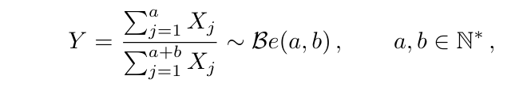

\addtolength{\headheight}{2cm}
\lhead{\includegraphics[height=1.5cm]{../../template_pdf_rmd/logo.png}}
\renewcommand{\headrulewidth}{1pt}


\pagestyle{fancyplain}
\renewcommand{\footrulewidth}{0pt}

```{r setup, include=FALSE}
knitr::opts_chunk$set(echo = TRUE)
source("../funcoes.R")
library(stats)
```

\newpage


# Questão 1:
Apresente o código de um método para gerar uma variável aleatória com a
seguinte função de densidade de probabilidade:

$f_X(x) = e^{-2|x|}, x \in \mathbb{R}$

```{r}
# Densidade
fx<-function(x)exp(-2*abs(x))
fx(-10)
curve(fx(x), from=-10, to=10)

Fx<-function(x)
{
  integrate(fx, lower = -10, upper = x)$value
}

Fx<-Vectorize(Fx)
Fx(1.891281e-06)
Fx(1)
Fx(-7)

Qxi<-function(x,prob)
{
  (Fx(x)-prob)^2
}

Qx<-function(p)
{
  optimize(Qxi,prob=p, maximum = F, lower = -10, upper = 10)$minimum
}
Qx<-Vectorize(Qx)

amostra<-Qx(runif(1000))
ks.test(amostra,Fx)
hist(amostra, breaks=100, freq = F)
curve(fx(x), from=-10, to=10, add=T, col="coral2", lwd=3)
```

\newpage

# Questão 2:

```{r}
u<-runif(1000)
Z<-log(u/(1-u))
hist(Z, freq = F)
curve(dlogis(x), from=-6, to=6, add = T, col="coral2")
ks.test(Z, "plogis")

# A distribuição logistica pertence a familia locação-escala
mu<-5
sigma<-2
X<-sigma*Z+5
hist(X, freq=F)
curve(dlogis(x, location = mu, scale = sigma), 
      from=mu-4*sigma, to=mu+4*sigma, add = T,
      col="coral2")

ks.test(X, "plogis") # Rejeitou, a X não tem locacao 0 e scala 1
ks.test(X, "plogis", location=mu, scale=sigma) 


```
\newpage


# Questão 3:

```{r}
alfa<-c(0.8, 0.87, 0.92, 0.95)

GerarU.alfa<-function(alfa)
{
  u<-runif(1)
  while(u>=alfa)
  {
    u<-runif(1)
  }
  return(u)
  
}

u<-runif(1000)
par(mfrow=c(4,2))
for(i in seq_along(alfa))
{
  amostra<-replicate(1000,GerarU.alfa(alfa[i]))
  hist(amostra, freq=F, breaks = 20,xlim=c(0,1), 
       main=paste0("Histograma da amostra (gerador 1), alfa = ", alfa[i]))
  curve(dunif(x,max=alfa[i]),from = 0, to=1, add=T, col="maroon", lwd=2)
  
  U.alfa<-alfa[i]*u
  hist(U.alfa, freq=F, breaks = 20 ,xlim=c(0,1), 
       main=paste0("Histograma da amostra (gerador 2), alfa = ", alfa[i]))
  curve(dunif(x,max=alfa[i]),from = 0, to=1, add=T, col="maroon", lwd=2)
}


```
Comparando pelos gráficos as duas formas de gerar a distribuição $U(0,\alpha)$ paracem equivalentes. Não observei nenhuma melhoria de um método para o outro.

\newpage


# Questão 4:

## Letra a:
```{r}

geradorCM<-function(m=((2^13)-1), A=17, seed=666,n) # congruencial multiplicativo
{
  u<-numeric(n)
  anterior<-seed
  for(i in 1:n)
  {
    x<-(anterior*A)%%m
    u[i]<-x
    anterior<-x
  }
  return(u)
}


```

## Letra b:

```{r}
X<-geradorCM(n=500)
```
## Letra c:

```{r}
cor(X[-1],X[-length(X)])
```
Os pares $x_i$ e $x_{i+1}$ possuem uma correlação baixa.


## Letra d:

```{r}
plot(X[-1],X[-length(X)])
```

Os pontos estão situados em diversas linhas.

**Variando o valor de A:**

```{r}
a<-c(4,5,7,17)
par(mfrow=c(2,2))
for(i in seq_along(a))
{
  X<-geradorCM(n=500, A=a[i])
  plot(X[-1],X[-length(X)], main=paste0("A = ", a[i]))
}
```
Para valores pares de "a" o período é curto e os números aléatórios gerados começam a repetir. Para a = 3 foi observado 3 retas, para a = 5, 5 retas e assim por diante. Para velores pequenos de **a** os números possuem uma correlação mais forte.

## Letra e:

```{r}
Y<-geradorCM(n=500,A=85)
cor(Y[-1],Y[-length(Y)])
plot(Y[-1],Y[-length(Y)])

```

## Letra f:
```{r}
plot(Y[-c(1,2)],Y[-c(length(Y),length(Y)-1)])
cor(Y[-c(1,2)],Y[-c(length(Y),length(Y)-1)])
```
Para a = 85 já apresenta uma corelação muito fraca, apesar dele não ser primo.

## Letra g:

Recomenda-se utilizar números primos altos para melhorar a qualidade do gerador.

\newpage

# Questão 5:

## Letra a:
Mostre que, se X1 e X2 são independentes e identicamente distribuídas de acordo com a normal padrão, então $C= \frac{X_1}{X_2}$ tem distribuição de Cauchy.
```{r}
set.seed(666)


rcauchy2<-function(n)
{
  
  Z<-rBM(n)
  Z
  C<-Z$z1/Z$z2
  return(C)

}
C<-rcauchy2(1000)  
hist(C, freq = F, breaks = 1000, xlim=c(-50,50))
curve(dcauchy(x), from=-10, to=10, col="coral2", add=T, lwd=3)

ks.test(C, "pcauchy")
```
O teste de Kolmogorov não rejeitou a hipótese de que *C* seja proveniente de uma Cauchy com parâmetro de locação igual 0 e de escala igual a 1. Dessa forma, mostramos de forma empírica o resultado.


## Letra b:

$F(x) = \frac{arctg(x)}{\pi}$
```{r}
qCauchy2<-function(p){ tan(pi*p) }

rcauchy3<-function(n)
{ 
  qCauchy2(runif(n))
}

C2<-rcauchy3(1000)
hist(C2, freq = F, breaks = 100)
curve(dcauchy(x), from=-10, to=10, col="coral2", add=T, lwd=3)

ks.test(C2,"pcauchy")
```

## Letra C:

```{r}
microbenchmark::microbenchmark(rcauchy2(1000),rcauchy3(1000), times = 100)
```
O segundo método é mais rápido, isso já era esperado primeiro necessita da geração de duas variáveis normais, o segundo parte da geração de apenas uma variável uniforme que será transformada.

\newpage


## Letra d:
Use o gerador de sua preferência e elabore código para verificar empiricamente o Teorema Central do Limite, simulando médias amostrais de amostra aleatória (variáveis aleatórias iid) de população de Cauchy.
```{r}
set.seed(666)
amostras<-replicate(1000,rcauchy3(100))
medias<-apply(amostras,2,mean)
hist(medias, breaks=100, col="lightblue3", freq = F)
curve(dcauchy(x), from = -1000, to=1000, add=T)

ks.test(medias, "pcauchy")


```
Sabemos que o Teorema do Limite Central não se aplica a Cauchy. A soma de n variáveis aleatórias independentes de Cauchy ($\theta_i$, $\sigma_i$) é uma variável aleatória de Cauchy ($\theta_i$ + ··· + $\theta_n$, $\sigma_i$ + ··· + $\sigma_n$).

Ao realizar o teste de aderência ( KS.test ) as médias parecem seguir uma distribuição igual a da população.

\newpage

# Questão 6:

```{r}
gera.Beta<-function(c)
{
  y<-runif(1)
  u<-runif(1)
  while(!u<=(dbeta(y, 2,5)/(c*dunif(y))))
  {
    y<-runif(1)
    u<-runif(1)
  }
  return(y)
}

r.Beta.RA<-function(n,shape1,shape2)
{
  shape1<-2
  shape2<-5
  moda<-(shape1-1)/(shape1+shape2-2)
  c<-dbeta(moda, shape1 = 2, shape2=5)
  return(replicate(n,gera.Beta(c)))
}

```

## Letra b:

```{r}
r.Beta.Transformacao<-function(n, shape1, shape2)
{
  U2<-runif((shape1+shape2)*n)
  U2<-matrix(data=U2,nrow=shape1+shape2)
  X2=-log(U2)
  return(apply(X2[1:shape1,],2,sum)/apply(X2,2,sum))
}
Y<-r.Beta.Transformacao(10^4, 2, 5)
hist(Y, freq = F)
curve(dbeta(x,shape1=2,shape2=5), add=T, col="aquamarine4", lwd=3)
```

```{r}
# A truncated normal generator 
rtnorm<-function(n=1,mu=0,sigma=1,lo=-Inf,up=Inf) # p.235, Robert e Casella, 
{
  qnorm(runif(n,min=pnorm(lo,mean=mu,sd=sigma),
  max=pnorm(up,mean=mu,sd=sigma)),
  mean=mu,sd=sigma)
}


dtnorm<-function(x,mu=0,sigma=1,lo=-Inf,up=Inf)
{
  (1/(pnorm(up, mu , sigma) - pnorm(lo, mu, sigma)))*dnorm(x, mu, sigma)
}

M<-optimize(f=function(x){dbeta(x,2,5)},interval=c(0,1),maximum =TRUE)$objective

j<-optimize(f=function(x){dbeta(x,2,5)},interval=c(0,1),maximum =TRUE)$maximum


curve(dbeta(x,2,5), ylim=c(0,3))
curve(M*dtnorm(x, 0,1,0,1), from=0, to=1, col="aquamarine4", add=T)

# O ideal seria encontrar o M em deixa a dtnorm tangente a beta no ponto 0.2000

f<-function(c)
{ 
  ifelse((M - c*dtnorm(j,0,1,0,1))>0,
         (M - c*dtnorm(j,0,1,0,1)),
         0) 
}

c<-optimize(f, interval = c(1,M))$minimum

curve(dbeta(x,2,5), ylim=c(0,3))
curve(c*dtnorm(x, 0,1,0,1), from=0, to=1, col="aquamarine4", add=T)

```

```{r}
cont<-1
gera.Beta<-function(c)
{
  y<-rtnorm(1, 0,1,0,1)
  u<-runif(1)
  while(!u<=(dbeta(y, 2,5)/(c*dtnorm(y, 0,1,0,1))))
  {
    y<-rtnorm(1, 0,1,0,1)
    u<-runif(1)
    cont<-cont+1
  }
  return(list(y,cont))
}
c
amostra<-replicate(1000,gera.Beta(c))
hist(as.numeric(amostra[1,]), freq = F)
curve(dbeta(x,2,5), add=T, col="aquamarine4", lwd=3)
contador<-sum(as.numeric(amostra[2,]))
contador
```
Para gerar 1000 valores foi necessário gerar na verdade `r contador` valores.

OBS: Não consegui finalizar a lista por falta de tempo.
